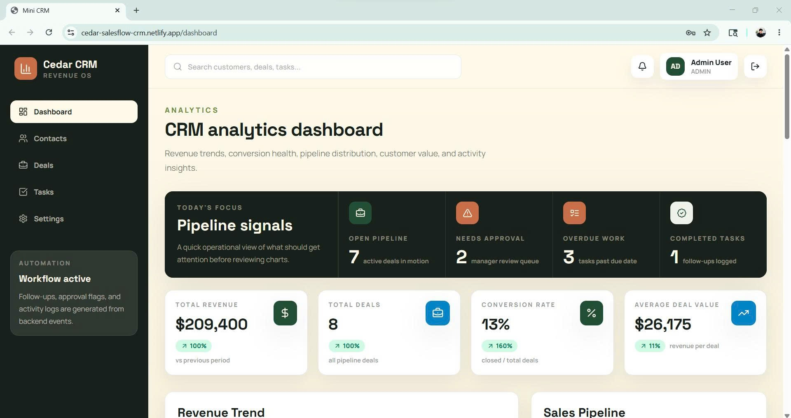
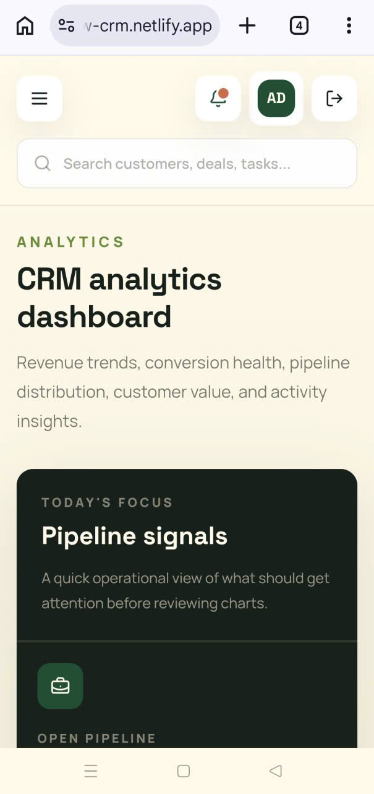
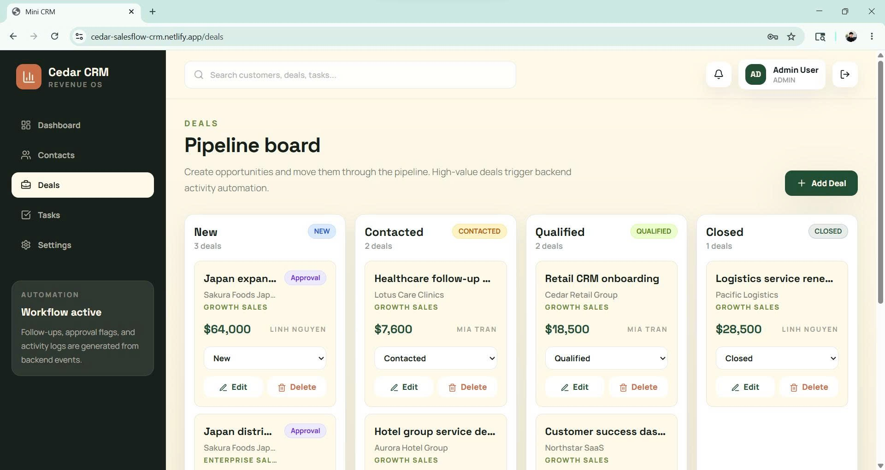
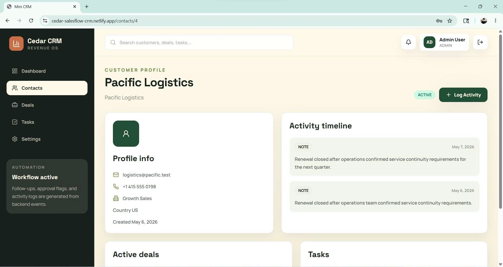

# SalesFlow CRM

SalesFlow CRM is a Salesforce-inspired revenue operations workspace built as a full-stack portfolio project. It models practical CRM workflows around customers, deals, tasks, activity history, role-based access control, and backend automation.

The project was designed for an intern software engineer application where CRM/Salesforce concepts, Java backend fundamentals, frontend implementation, and business workflow understanding matter.

## Live Demo

- Frontend: https://cedar-salesflow-crm.netlify.app
- Backend API: https://salesflow-crm-production.up.railway.app
- Repository: https://github.com/luphihung-dev/SalesFlow-CRM

Demo accounts:

| Role | Email | Password | What to Test |
|---|---|---|---|
| Admin | `admin@crm.local` | `Admin12345` | Full workspace access, settings, delete permissions |
| Manager | `manager@crm.local` | `Manager12345` | Team pipeline, team tasks, manager delete for deals/tasks |
| Sales | `sales@crm.local` | `Sales12345` | Own pipeline, own tasks, add/edit contacts, mobile workflow |

## Screenshots

Add screenshots to `docs/screenshots/` using these filenames:

| Screen | File |
|---|---|
| Dashboard analytics | `docs/screenshots/dashboard-desktop.png` |
| Mobile navigation and notifications | `docs/screenshots/mobile-dashboard.png` |
| Deal pipeline board | `docs/screenshots/deals-pipeline.png` |
| Customer profile timeline | `docs/screenshots/customer-profile.png` |

```md




```

## Why This Project Fits Salesforce CRM

SalesFlow CRM is not built on the Salesforce Platform directly. Instead, it is a traditional full-stack implementation built to show that I understand the CRM domain and can implement the underlying web/backend concepts myself.

Concept mapping:

| SalesFlow CRM | Salesforce Concept |
|---|---|
| Customer | Account / Contact |
| Deal | Opportunity |
| Task | Salesforce Task |
| Activity timeline | Activity history |
| Backend automation events | Flow / Apex Trigger-style automation |
| Manager approval flag | Approval Process concept |
| Admin / Manager / Sales roles | Profile / Role / Permission Set / Sharing concept |
| Dashboard analytics | Salesforce Reports / Dashboards |

This project helped me practice the same ideas that appear in Salesforce CRM: customer data, opportunity tracking, follow-up ownership, role-based visibility, and automation around business events.

## Tech Stack

Backend:

- Java 17
- Spring Boot 3
- Spring Security
- Spring Data JPA / Hibernate
- PostgreSQL
- JWT authentication
- Maven

Frontend:

- React
- Vite
- Tailwind CSS
- Axios
- Recharts
- Lucide React icons

Deployment:

- Frontend: Netlify
- Backend: Railway
- Database: Neon PostgreSQL

## Core Features

- JWT login with persisted frontend session.
- Role-based access for Admin, Manager, and Sales.
- Team/owner-based data visibility.
- Customer directory with status, country, phone validation, and profile pages.
- Deal pipeline board with stage movement and approval signals.
- Task work queue with overdue detection and completion flow.
- Activity timeline for customer notes, calls, emails, and automation logs.
- Dashboard analytics for revenue, conversion, pipeline, task completion, and activity.
- Global search across customers, deals, tasks, stages, owners, and teams.
- Notification dropdown for overdue tasks, approval-needed deals, and high-value deal signals.
- Responsive mobile layout with drawer navigation and mobile table cards.

## Security & RBAC

Authentication:

- `POST /api/auth/login` verifies email/password through Spring Security.
- Successful login returns a JWT bearer token and user profile.
- Protected API requests require `Authorization: Bearer <token>`.

Authorization is enforced in the service layer, not only in the UI.

| Role | Customers | Deals | Tasks | Settings |
|---|---|---|---|---|
| Admin | View/create/edit/delete all | View/create/edit/delete all | View/create/edit/delete all | Access |
| Manager | View/create/edit team contacts | View/create/edit/delete team deals | View/create/edit/delete team tasks | No access |
| Sales | View/add/edit related contacts, no delete | View/create/edit own deals, no delete | View/create/edit own tasks, mark done, no delete | No access |

Important implementation notes:

- Admin has full workspace access.
- Manager is scoped to their team.
- Sales is scoped to owned deals, assigned tasks, and related customers.
- Customer deletion is intentionally Admin-only; Managers and Sales can use `INACTIVE` instead of removing account history.
- Backend services re-check every protected operation before reading, writing, or deleting records.

## Automation Rules

The backend uses Spring domain events to model Salesforce-style automation:

- Customer created -> create a follow-up task due in 2 days.
- Sales-created customer -> assign the follow-up task to that Sales user.
- Deal created above `$10,000` -> log a high-value activity note.
- Deal created above `$50,000` -> require manager approval and log an approval note.
- Deal moved to `CLOSED` -> log a closed-deal activity.
- Task moved to `DONE` -> log task completion into the customer activity timeline.
- Overdue task -> surfaced to the frontend notification center.

Automation code:

```text
src/main/java/com/example/minicrm/automation
src/main/java/com/example/minicrm/event
```

## API Overview

Auth:

- `POST /api/auth/login`

Main resources:

- `GET /api/users`
- `GET /api/teams`
- `GET /api/customers`
- `GET /api/customers/{id}`
- `GET /api/deals`
- `GET /api/tasks`
- `GET /api/activities`

Create, update, and delete endpoints are protected by role and team rules in the backend service layer.

## Local Setup

Requirements:

- Java 17+
- Maven 3.9+
- Node.js 18+
- PostgreSQL 15+ or Neon PostgreSQL

Backend environment variables:

```bash
DATABASE_URL=jdbc:postgresql://localhost:5432/mini_crm
DATABASE_USERNAME=crm_user
DATABASE_PASSWORD=crm_password
JWT_SECRET=replace-with-a-64-character-random-secret-before-deploy
JWT_EXPIRATION_MS=86400000
CORS_ALLOWED_ORIGINS=http://localhost:5173,http://127.0.0.1:5173
BOOTSTRAP_ADMIN_NAME=Admin User
BOOTSTRAP_ADMIN_EMAIL=admin@crm.local
BOOTSTRAP_ADMIN_PASSWORD=Admin12345
```

Run backend:

```bash
mvn spring-boot:run
```

Run frontend:

```bash
cd frontend
npm install
npm run dev
```

Local frontend:

```text
http://localhost:5173
```

For frontend-only local testing against the deployed backend, create `frontend/.env.local`:

```bash
VITE_API_BASE_URL=https://salesflow-crm-production.up.railway.app/api
```

## Deployment

Frontend deployment uses Netlify:

- Build command: `cd frontend && npm install && npm run build`
- Publish directory: `frontend/dist`
- SPA routing configured in `netlify.toml`

Frontend environment variable:

```bash
VITE_API_BASE_URL=https://salesflow-crm-production.up.railway.app/api
```

Backend deployment uses Railway:

- Java runtime configured in `system.properties`
- Build/deploy configured in `railway.toml`
- PostgreSQL connection provided by Neon environment variables

Railway variables:

```bash
DATABASE_URL=jdbc:postgresql://<neon-host>/<database>?sslmode=require
DATABASE_USERNAME=<neon-user>
DATABASE_PASSWORD=<neon-password>
JWT_SECRET=<64+ character random secret>
JWT_EXPIRATION_MS=86400000
CORS_ALLOWED_ORIGINS=https://cedar-salesflow-crm.netlify.app,http://localhost:5173
BOOTSTRAP_ADMIN_NAME=Admin User
BOOTSTRAP_ADMIN_EMAIL=admin@crm.local
BOOTSTRAP_ADMIN_PASSWORD=<strong-demo-password>
```

## Demo Data

The app seeds HR-friendly CRM demo data:

- Growth Sales and Enterprise Sales teams.
- Retail, clinic, logistics, SaaS, hotel, education, and Japan expansion accounts.
- Opportunities across `NEW`, `CONTACTED`, `QUALIFIED`, and `CLOSED`.
- Overdue and upcoming follow-up tasks.
- Activity timeline entries that explain business context.

Seed data is idempotent for known demo records, so redeploys update the demo story without duplicating the same records.

## What I Would Improve In Production

- Add refresh token rotation or HttpOnly secure-cookie based auth.
- Add login rate limiting and account lockout.
- Add audit log fields such as `createdBy`, `updatedBy`, `createdAt`, `updatedAt`.
- Replace hard delete with soft delete/archive for important CRM records.
- Add server-side pagination, sorting, and filtering.
- Move global search to a backend search endpoint.
- Replace `spring.jpa.hibernate.ddl-auto=update` with Flyway or Liquibase migrations.
- Add integration tests for auth, RBAC, and CRUD permissions.
- Add GitHub Actions CI for backend and frontend build checks.
- Add monitoring, structured logging, and database backup/restore procedures.

## Verification

Backend:

```bash
mvn test
```

Frontend:

```bash
cd frontend
npm run lint
npm run build
```

Manual live demo checklist:

- Login as Admin, Manager, and Sales.
- Verify Manager only sees team records.
- Verify Sales only sees own pipeline/tasks and related contacts.
- Create a Sales contact and confirm follow-up task automation.
- Create a high-value deal and confirm approval/notification behavior.
- Move a task to `DONE` and confirm activity timeline logging.
- Test dashboard, contacts, deals, tasks, search, and notifications on mobile.

## Notes

- Demo credentials are intended for evaluation only.
- Do not commit real database credentials or JWT secrets.
- Generated folders such as `target/`, `frontend/node_modules/`, and `frontend/dist/` are ignored.
